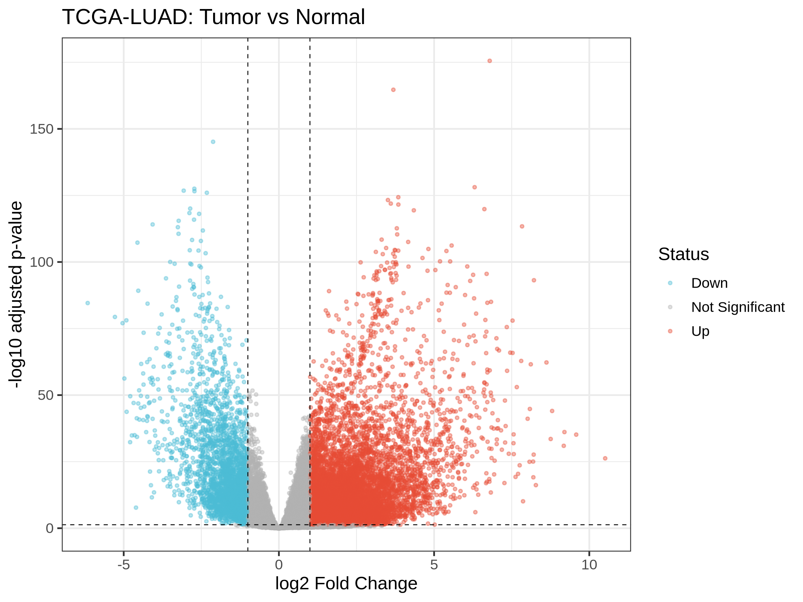
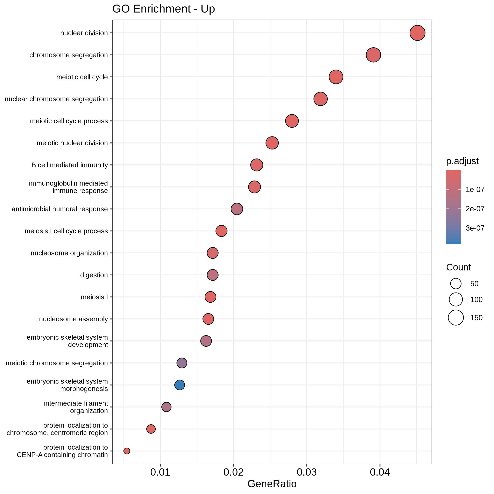
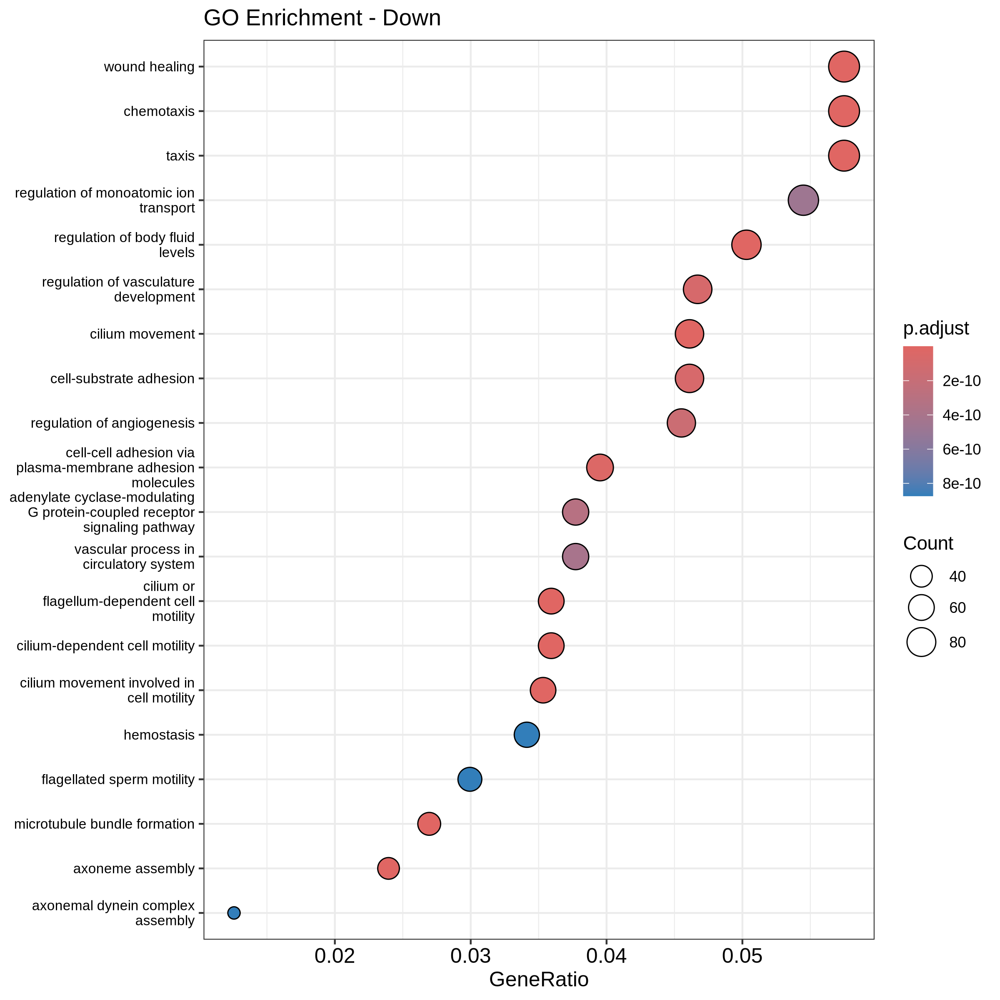

# TCGA-LUAD RNA-seq DEG Analysis

TCGA 공개 데이터를 활용한 폐암(LUAD) 유전자 발현 차등 분석 파이프라인

## 분석 개요
- **데이터**: TCGA-LUAD (Lung Adenocarcinoma)
- **샘플**: Primary Tumor 540개 vs Solid Tissue Normal 59개
- **비교**: Tumor vs Normal
- **도구**: R, DESeq2, clusterProfiler, TCGAbiolinks

## 분석 파이프라인

## 주요 결과

### DEG 요약
| 구분 | 유전자 수 | 기준 |
|------|----------|------|
| Upregulated | 11,158개 | padj < 0.05, log2FC > 1 |
| Downregulated | 2,820개 | padj < 0.05, log2FC < -1 |

### Volcano Plot

### GO Enrichment - Upregulated
암에서 과발현된 유전자들은 **세포분열, 염색체 분리, 핵분열** 경로에 집중됨

### GO Enrichment - Downregulated
암에서 저발현된 유전자들은 **섬모 운동, 혈관 조절, 면역세포 이동** 경로에 집중됨

## 결과 파일
| 파일 | 설명 |
|------|------|
| `results/volcano_LUAD.png` | Volcano plot |
| `results/go_up.png` | GO Enrichment - Upregulated |
| `results/go_down.png` | GO Enrichment - Downregulated |
| `data/DEG_results.csv` | DEG 전체 결과 테이블 |
| `data/res_df.rds` | DESeq2 결과 R 객체 |
| `scripts/LUAD_DEG_analysis.R` | 전체 분석 스크립트 |

## 환경
- R 4.4
- TCGAbiolinks
- DESeq2
- clusterProfiler
- enrichplot
- org.Hs.eg.db
- ggplot2
